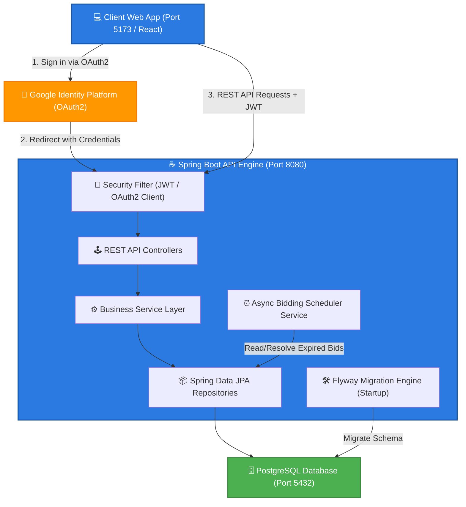
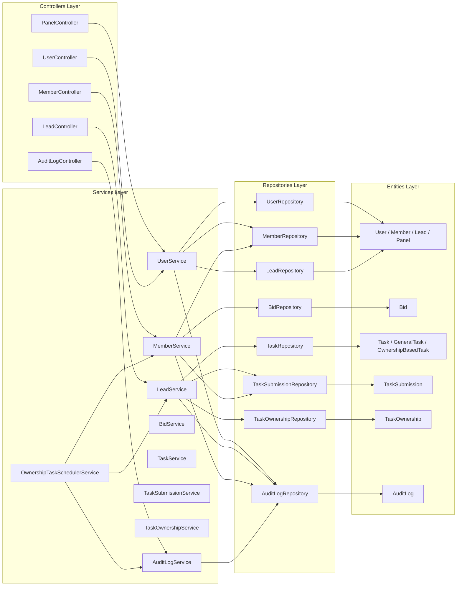
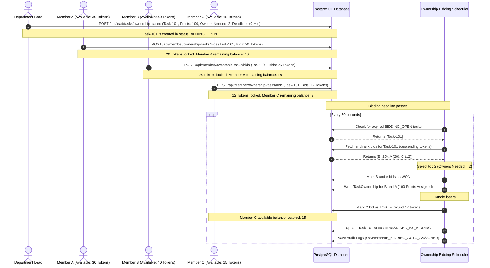
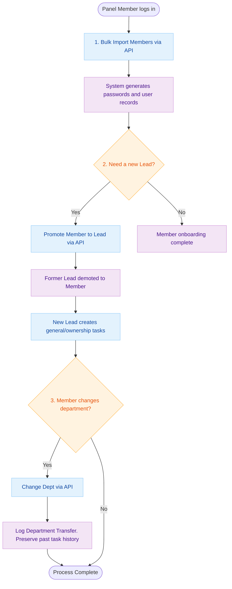
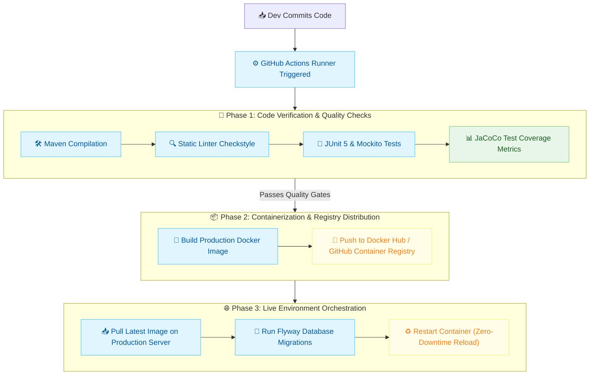

# 🏛️ ClubOS (Club Operating System)

[](file:///Users/hariharasudhan/Documents/eclipse/ClubOS/pom.xml#L30)
[](file:///Users/hariharasudhan/Documents/eclipse/ClubOS/pom.xml#L5-L10)
[](file:///Users/hariharasudhan/Documents/eclipse/ClubOS/schema.sql)
[](file:///Users/hariharasudhan/Documents/eclipse/ClubOS/src/main/resources/db/migration)
[](file:///Users/hariharasudhan/Documents/eclipse/ClubOS/LICENSE)

ClubOS is a backend governance engine designed for modern student and professional organizations. It gamifies project delivery and administration through a tokenized task-bidding framework, role-based access controls, and transparent audit logging.

---

## 🗺️ Table of Contents

1. [Overview & Core Domain](#-overview--core-domain)
2. [Key Features](#-key-features)
3. [System Architecture](#%EF%B8%8F-system-architecture)
4. [Prerequisites](#-prerequisites)
5. [Installation & Local Setup](#-installation--local-setup)
6. [Configuration & Environment Variables](#-configuration--environment-variables)
7. [API Documentation](#-api-documentation)
8. [Usage Scenarios & End-to-End Examples](#-usage-scenarios--end-to-end-examples)
9. [Project Structure](#-project-structure)
10. [Development Workflow & Testing](#-development-workflow--testing)
11. [CI/CD Pipeline](#-cicd-pipeline)
12. [Deployment Guidelines](#-deployment-guidelines)
13. [Troubleshooting & FAQ](#-troubleshooting--faq)
14. [Roadmap](#%EF%B8%8F-roadmap)
15. [Contributing & Code of Conduct](#-contributing--code-of-conduct)
16. [Security Policy](#-security-policy)
17. [License & Acknowledgements](#-license--acknowledgements)

---

## 🔍 Overview & Core Domain

Organizations struggle with member engagement, unequal task distribution, and opaque administrative decisions. **ClubOS** solves these governance problems by:

1. **Gamifying Task Assignment**: Members bid on high-impact, ownership-based tasks using a monthly allowance of tokens.
2. **Securing Roles**: Enforcing a strict three-tier role hierarchy:
   - **Panel**: System administrators responsible for organizational alignment, department transfers, and promoting members.
   - **Lead**: Department managers who create tasks, assign points, review submissions, and direct-assign tasks when necessary.
   - **Member**: Core contributors who bid on tasks, track remaining capacity, and submit completed work.
3. **Enforcing Governance Overrides**: Leads can bypass open bidding for urgent tasks by directly assigning them. To maintain fairness, this action automatically slashes the task's reward points to **60% of their original value**.
4. **Providing an Immutable Audit Trail**: Recording every single administrative action (onboarding, promotions, bids, transfers, reviews) for complete transparency.

---

## ✨ Key Features

- **Gamified Bidding Engine**: Automated periodic worker ranks bids by tokens, selects winning bids up to the owner limit, marks losers, and automatically refunds tokens back to unsuccessful bidders' balances.
- **Transactional Safety & Token Locks**: Pending bids lock tokens from the member's available balance in real time. Updating or deleting bids releases or captures additional tokens safely.
- **Google OAuth2 & JWT Security**: Stateless authentication layer. New accounts securely exchange tokens through Google OAuth2, generating a signed JWT for sub-routing authentication.
- **Robust Database Constraints & Performance Indexes**: Flyway database migrations configure optimized composite indexes for high-frequency queries (bids, submissions, audit logs).
- **Embedded Swagger/OpenAPI UI**: Auto-generated live interactive documentation at `/swagger-ui.html`.

---

## 🏛️ System Architecture

ClubOS follows a clean Spring Boot layer architecture: REST controller endpoints route incoming actions through transaction-wrapped Services, reading and writing to PostgreSQL using Spring Data JPA.

### Container Architecture Diagram

The overall container context of ClubOS and external identity integrations:



### Backend Components & Layers Diagram

A high-level view showing the exact mappings between Controllers, Services, Repositories, and Entities:



---

## 📋 Prerequisites

To run this project locally, ensure you have the following installed:

- **Java Development Kit (JDK) 21**: Recommended runtime is Temurin 21.
- **Maven 3.9+**: For dependency resolution and project packaging.
- **Docker & Docker Compose**: To run the PostgreSQL multi-container setup.
- **Google Cloud Console Developer Account**: To register credentials for Google OAuth2 Login.

---

## 🚀 Installation & Local Setup

### 1. Clone the Repository

```bash
git clone https://github.com/hari-hara-sudhann/ClubOS.git
cd ClubOS
```

### 2. Configure Environment Variables

Copy the sample environment template file to create your local configurations:

```bash
cp .env-sample .env
```

Open [`.env`](file:///Users/hariharasudhan/Documents/eclipse/ClubOS/.env) and populate the values:

```env
DATABASE_URL=jdbc:postgresql://db:5432/clubos
DATABASE_USERNAME=clubos
DATABASE_PASSWORD=your_secure_password
JWT_SECRET=your_super_secret_signing_key_at_least_256_bits_long
JWT_EXPIRATION=86400000
GOOGLE_CLIENT_ID=your_google_client_id.apps.googleusercontent.com
GOOGLE_CLIENT_SECRET=your_google_client_secret
FRONTEND_URL=http://localhost:5173
```

### 3. Spin Up Services Using Docker Compose

This launches the PostgreSQL database container and executes automated Flyway schema migrations:

```bash
docker compose up -d db
```

To run both the application and database containers together (fully orchestrated):

```bash
docker compose up --build
```

### 4. Run Locally (Development Mode)

If running the Spring Boot backend outside Docker (on your host machine):

```bash
# Export the environment variables from .env
export $(grep -v '^#' .env | xargs)

# Run the project using Maven
./mvnw spring-boot:run
```

---

## ⚙️ Configuration & Environment Variables

The backend loads application configs from [`src/main/resources/application.yml`](file:///Users/hariharasudhan/Documents/eclipse/ClubOS/src/main/resources/application.yml).

| Variable Name          | Description                                    | Default Value / Template           |
| :--------------------- | :--------------------------------------------- | :--------------------------------- |
| `DATABASE_URL`         | PostgreSQL JDBC connection URL                 | `jdbc:postgresql://db:5432/clubos` |
| `DATABASE_USERNAME`    | Database connection username                   | `clubos`                           |
| `DATABASE_PASSWORD`    | Database connection password                   | `admin123`                         |
| `JWT_SECRET`           | Secret HMAC-SHA key to sign tokens             | _256-bit secure key_               |
| `JWT_EXPIRATION`       | Validity duration of signed JWTs in ms         | `86400000` (24 Hours)              |
| `GOOGLE_CLIENT_ID`     | OAuth2 Client ID from Google Cloud Console     | _Varies_                           |
| `GOOGLE_CLIENT_SECRET` | OAuth2 Client Secret from Google Cloud Console | _Varies_                           |
| `FRONTEND_URL`         | Client application origin (CORS configuration) | `http://localhost:5173`            |

---

## 🔌 API Documentation

Once the backend is running, the interactive Swagger UI and raw OpenAPI descriptors are available at:

- **Interactive Swagger UI**: `http://localhost:8080/swagger-ui/index.html`
- **OpenAPI OpenAPI Specifications (JSON)**: `http://localhost:8080/v3/api-docs`

### Major Endpoint Mappings

| Role       | Endpoint Path                                             | Method  | Description                                           | Source File                                                                                                                                   |
| :--------- | :-------------------------------------------------------- | :-----: | :---------------------------------------------------- | :-------------------------------------------------------------------------------------------------------------------------------------------- |
| **All**    | `/health`                                                 |  `GET`  | Health status checker (returns `OK`)                  | [HealthController](file:///Users/hariharasudhan/Documents/eclipse/ClubOS/src/main/java/com/codeygen/clubos/controllers/HealthController.java) |
| **All**    | `/api/users/login`                                        | `POST`  | User login placeholder / Authenticates JWT            | [UserController](file:///Users/hariharasudhan/Documents/eclipse/ClubOS/src/main/java/com/codeygen/clubos/controllers/UserController.java)     |
| **Panel**  | `/api/panel/members/bulk-onboard`                         | `POST`  | Import a batch of new members with temp passwords     | [PanelController](file:///Users/hariharasudhan/Documents/eclipse/ClubOS/src/main/java/com/codeygen/clubos/controllers/PanelController.java)   |
| **Panel**  | `/api/panel/members/{id}/promote-to-lead`                 | `PATCH` | Promote a member to Lead (demotes current Lead)       | [PanelController](file:///Users/hariharasudhan/Documents/eclipse/ClubOS/src/main/java/com/codeygen/clubos/controllers/PanelController.java)   |
| **Panel**  | `/api/panel/members/{id}/department/{deptId}`             | `PATCH` | Transfer member to a different department             | [PanelController](file:///Users/hariharasudhan/Documents/eclipse/ClubOS/src/main/java/com/codeygen/clubos/controllers/PanelController.java)   |
| **Lead**   | `/api/lead/tasks/general`                                 | `POST`  | Assign a general task to a department                 | [LeadController](file:///Users/hariharasudhan/Documents/eclipse/ClubOS/src/main/java/com/codeygen/clubos/controllers/LeadController.java)     |
| **Lead**   | `/api/lead/tasks/ownership-based`                         | `POST`  | Create ownership task (starts bidding)                | [LeadController](file:///Users/hariharasudhan/Documents/eclipse/ClubOS/src/main/java/com/codeygen/clubos/controllers/LeadController.java)     |
| **Lead**   | `/api/lead/tasks/ownership-based/direct-owner-assignment` | `PATCH` | Bypass bidding and direct-assign (slashes pts to 60%) | [LeadController](file:///Users/hariharasudhan/Documents/eclipse/ClubOS/src/main/java/com/codeygen/clubos/controllers/LeadController.java)     |
| **Lead**   | `/api/lead/tasks/{id}/submissions`                        |  `GET`  | Retrieve member submissions for review                | [LeadController](file:///Users/hariharasudhan/Documents/eclipse/ClubOS/src/main/java/com/codeygen/clubos/controllers/LeadController.java)     |
| **Lead**   | `/api/lead/tasks/submissions/review`                      | `PATCH` | Approve or Reject a submission                        | [LeadController](file:///Users/hariharasudhan/Documents/eclipse/ClubOS/src/main/java/com/codeygen/clubos/controllers/LeadController.java)     |
| **Member** | `/api/member/ownership-tasks/bids`                        | `POST`  | Bid tokens on a pending ownership-based task          | [MemberController](file:///Users/hariharasudhan/Documents/eclipse/ClubOS/src/main/java/com/codeygen/clubos/controllers/MemberController.java) |
| **Member** | `/api/member/ownership-tasks/bids`                        | `PATCH` | Modify token quantity for a pending bid               | [MemberController](file:///Users/hariharasudhan/Documents/eclipse/ClubOS/src/main/java/com/codeygen/clubos/controllers/MemberController.java) |
| **Member** | `/api/member/{id}/bidding/remaining-tokens`               |  `GET`  | Get remaining uncommitted tokens                      | [MemberController](file:///Users/hariharasudhan/Documents/eclipse/ClubOS/src/main/java/com/codeygen/clubos/controllers/MemberController.java) |
| **Member** | `/api/member/tasks/submissions`                           | `POST`  | Submit completed task work with evidence              | [MemberController](file:///Users/hariharasudhan/Documents/eclipse/ClubOS/src/main/java/com/codeygen/clubos/controllers/MemberController.java) |

---

## 🔄 Usage Scenarios & End-to-End Examples

### Scenario: End-to-End Task Bidding & Resolution

This sequence diagram illustrates the lifecycle of a gamified bidding resolution task:



### Scenario: Panel Member Governance Workflows

Below is the administrative flow showing member onboarding, lead assignment, and department transfers:



---

## 📂 Project Structure

```
ClubOS/
├── .mvn/                     # Maven Wrapper config
├── docs/                     # Documentation artifacts
│   ├── api-docs.json         # Extracted raw OpenAPI Specifications
│   └── erd.png               # Database Entity Relationship Diagram
├── mvnw                      # Maven wrapper script (Unix)
├── mvnw.cmd                  # Maven wrapper script (Windows)
├── pom.xml                   # Maven build and dependency config
├── Dockerfile                # Container assembly recipe (Multi-stage build)
├── docker-compose.yml        # Orchestration configuration
├── schema.sql                # Complete auto-generated database schema
└── src/
    ├── main/
    │   ├── java/com/codeygen/clubos/
    │   │   ├── ClubOsApplication.java     # Boot entrypoint
    │   │   ├── configs/                   # Security & Swagger OpenAPI config
    │   │   │   ├── SecurityConfig.java    # OAuth2/JWT security filters
    │   │   │   └── OpenApiConfig.java     # Swagger UI layout specifications
    │   │   ├── controllers/               # REST Endpoints
    │   │   │   ├── LeadController.java    # Tasks assignments, review endpoints
    │   │   │   ├── MemberController.java  # Bids, submissions endpoints
    │   │   │   └── PanelController.java   # Governance administration endpoints
    │   │   ├── dtos/                      # Data Transfer Objects
    │   │   ├── entities/                  # JPA Database Entities
    │   │   │   ├── user/                  # Member, Lead, Panel database tables
    │   │   │   ├── tasks/                 # Task, Submission, Ownership models
    │   │   │   └── audit/                 # AuditLog mapping entities
    │   │   ├── logging/                   # Request logging filters
    │   │   ├── repositories/              # Spring Data JPA Repository interfaces
    │   │   ├── services/                  # Business Logic implementations
    │   │   │   └── OwnershipTaskSchedulerService.java # Async bidding resolver
    │   │   └── utils/                     # JWT tokens, validation libraries
    │   └── resources/
    │       ├── application.yml            # System YAML configuration details
    │       └── db/migration/              # Flyway SQL versioning scripts
    └── test/
        └── java/com/codeygen/clubos/
            ├── ClubOsApplicationTests.java # Core context load tests
            └── services/                  # Service Layer Unit & Mockito Tests
```

---

## 🛠️ Development Workflow & Testing

### Compilation and Linting

To verify coding syntax, check annotations, and build without packaging artifacts:

```bash
./mvnw clean compile
```

### Running Test Suite

ClubOS uses JUnit 5 alongside Mockito for unit testing, and spins up local H2 databases in runtime-test profile for repository integrations. To execute the tests and generate a coverage report:

```bash
./mvnw test
```

### Test Coverage Report (JaCoCo)

The build file integrates the [JaCoCo Maven Plugin](file:///Users/hariharasudhan/Documents/eclipse/ClubOS/pom.xml#L169-L186). After executing the tests, check the generated report locally:

```bash
open target/site/jacoco/index.html
```

---

## 🚀 CI/CD Pipeline

The software project uses a GitHub Actions workflow to automate quality validation and deployments. Below is the deployment lifecycle flow:



---

## 🌐 Deployment Guidelines

### 1. Production Docker Deployments

To deploy ClubOS to production servers using containerization:

1. Ensure the remote environment variables are exported or placed inside `/etc/environment`.
2. Deploy the stack using Docker Compose:
   ```bash
   docker compose -f docker-compose.yml up -d --build
   ```

### 2. Standard Spring Boot executable JAR

To generate a production-ready single jar containing all compiled code:

```bash
./mvnw package -DskipTests
```

The artifact is saved at `target/clubos-1.0.0.jar`. Launch it with:

```bash
java -jar -Dspring.profiles.active=prod target/clubos-1.0.0.jar
```

---

## ❓ Troubleshooting & FAQ

#### Q: How do I change the frequency of the bidding deadline scheduler?

- **A**: Open [`OwnershipTaskSchedulerService.java`](file:///Users/hariharasudhan/Documents/eclipse/ClubOS/src/main/java/com/codeygen/clubos/services/OwnershipTaskSchedulerService.java#L34). Modify the duration parameter inside `@Scheduled(fixedDelay = 60000)`. (Value is in milliseconds; `60000` is 60 seconds).

#### Q: The database migration failed on container startup. What should I do?

- **A**: Ensure PostgreSQL has fully initialized before starting the app. The `docker-compose.yml` uses a postgres container `healthcheck` script, verifying database readiness using `pg_isready` before launching the Spring Boot image. If you manually altered migrations, clear metadata locks using `mvn flyway:repair`.

#### Q: Where can I trace administrative overrides and auditing history?

- **A**: All auditable events are persisted in the `audit_log` table. Inspect logs using `GET /api/audit-logs` endpoint or examine [`AuditLogController.java`](file:///Users/hariharasudhan/Documents/eclipse/ClubOS/src/main/java/com/codeygen/clubos/controllers/AuditLogController.java).

---

## 🗺️ Roadmap

- [ ] **Dynamic Web Dashboard**: Interactive frontend dashboard in React.js.
- [ ] **Discord & Slack Webhooks**: Send automated alerts to channels when a task bidding session resolves.
- [ ] **Advanced Organization Hierarchy**: Support for sub-committees and nested departments.
- [ ] **Monthly Reset Automation**: Auto-replenishing token allowances and reporting stats on monthly cycles.

---

## 🤝 Contributing & Code of Conduct

Contributions are welcome! Please follow these steps to contribute:

1. Fork the repository.
2. Create a feature branch (`git checkout -b feature/amazing-feature`).
3. Commit your changes (`git commit -m 'Add amazing feature'`).
4. Push to the branch (`git push origin feature/amazing-feature`).
5. Open a Pull Request.

Please ensure your code complies with the project's formatting rules and has corresponding Unit Tests.

---

## 🛡️ Security Policy

If you discover a security vulnerability, please do not open a public issue. Instead, email a detailed description to `hari.shenbagan@gmail.com`. We aim to evaluate and patch confirmed security issues within 72 hours.

---

## 📄 License & Acknowledgements

This project is licensed under the MIT License. See [LICENSE](file:///Users/hariharasudhan/Documents/eclipse/ClubOS/LICENSE) for details.

Special thanks to:

- **Spring Boot Starter Suite** for the core frameworks.
- **Flyway DB** for smooth migrations.
- **Lombok** for reducing boilerplate code.
